<div align="center">

# 👋 **Hello, World!** I'm Zekarias Solomon


[](https://github.com/akilas-solo)
[](https://github.com/akilas-solo)

</div>

---

## 🚀 **About Me**

I'm a **passionate web and app developer** who believes in building software that makes a real difference in people's lives. My journey into tech started with pure curiosity and has evolved into a fulfilling career where I get to solve meaningful problems through code.

```javascript
const zekarias = {
    name: "Zekarias Solomon",
    role: "Full-Stack Developer",
    passion: "Backend Development",
    location: "Ethiopia 🇪🇹",
    philosophy: "Code with purpose, build with passion",
    currentFocus: ["AI Integration", "Scalable APIs", "Modern Web Apps"],
    lifeGoals: ["Solve real problems", "Share knowledge", "Build amazing software"]
};
```

---

## 🛠️ **Tech Arsenal**

<div align="center">

### **Frontend Development**


### **Backend Development** ⭐ *My Favorite Playground*


### **Database & Cloud**


### **Tools & Workflow**


</div>

---

## 📊 **GitHub Analytics**

<div align="center">
  
  
</div>

<div align="center">
  
</div>

---

## 🏆 **Project Highlights**

<div align="center">

| 🚀 **Project** | 🛠️ **Tech Stack** | 📝 **Description** |
|:---|:---|:---|
| **🔐 Afar National Security Intelligence System** | Reat, Firebase, MongoDb | Enterprise-grade security information management system |
| **💳 Mobile Banking Wallet App** | React Native, Node.js, MongoDB | Secure mobile banking solution for fintech startup |
| **☕ Cafe Billing System** | React, Express.js, MySQL | Streamlined operations system for Semera University |
| **📰 News Aggregator API** | Node.js, AI Integration, WebSocket | AI-powered news platform with real-time updates |

</div>

---

## 🌱 **What Drives Me**

```mermaid
mindmap
  root((Zekarias))
    🎯 **Core Values**
      Lifelong Learning
      Knowledge Sharing
      Team Collaboration
      Problem Solving
    💡 **Passions**
      Backend Architecture
      API Development
      System Design
      Clean Code
    🚀 **Goals**
      Build Impactful Software
      Mentor Developers
      Open Source Contribution
      Tech Innovation
```

<div align="center">



</div>

### **🔥 What Keeps Me Going:**
- **🧠 Continuous Learning**: Always exploring new technologies and best practices
- **🤝 Collaboration**: Believing that great solutions come from teamwork
- **🎯 Problem Solving**: Turning complex challenges into elegant solutions
- **📚 Knowledge Sharing**: Contributing to the developer community

---

## 🎵 **Beyond Code**

<div align="center">

| 🎶 **Music** | 🚗 **Cars** | 💡 **Creativity** |
|:---:|:---:|:---:|
| Jazz & Blues enthusiast | Avid car enthusiast | Analytical + Creative thinking |
| *Fuels my creativity* | *Dreaming of a bigger garage* | *Unique problem-solving approach* |

</div>

---

## 📈 **Current Focus**

<div align="center">

```typescript
interface CurrentGoals {
  learning: string[];
  building: string[];
  contributing: string[];
}

const myCurrentFocus: CurrentGoals = {
  learning: [
    "Advanced AI Integration",
    "Microservices Architecture", 
    "Cloud-Native Development",
    "DevOps Best Practices"
  ],
  building: [
    "Scalable API Systems",
    "Real-time Applications",
    "AI-Powered Solutions",
    "Mobile-First Platforms"
  ],
  contributing: [
    "Open Source Projects",
    "Developer Community",
    "Technical Writing",
    "Mentoring Programs"
  ]
};
```

</div>

---

## 🤝 **Let's Connect & Collaborate**

<div align="center">

I'm always excited to connect with fellow developers, entrepreneurs, and tech enthusiasts. Whether you want to collaborate on a project, discuss technology, or just say hi, I'd love to hear from you!

[](mailto:zekariassolomon14@gmail.com)
[](https://linkedin.com/in/zekarias-solomon-11a540372)
[](https://github.com/akilas-solo)

### **💬 Open to:**
- 🚀 **Exciting Projects** - Full-stack, backend, or mobile development
- 🤝 **Collaborations** - Building innovative solutions together
- 💼 **Opportunities** - New challenges and career growth
- 🎓 **Mentoring** - Helping fellow developers grow
- ☕ **Coffee Chats** - Discussing tech, ideas, and life

</div>

---

<div align="center">

### 🌟 **"Code with purpose, build with passion, share with generosity"**

*Thanks for visiting my profile! Let's build something incredible together! 🚀*


</div>
